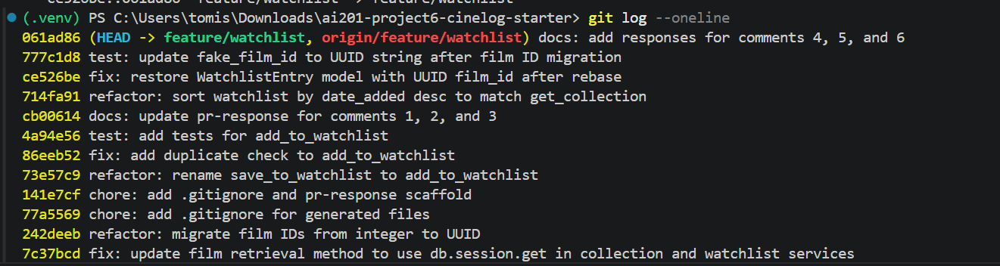

# PR Response Doc — CineLog Watchlist Feature

## git log --oneline



## AI Usage

Amazon Q (AI assistant in the IDE) was used throughout this project in the following ways:

- **Codebase orientation:** Provided full file contents of `models.py`, `collection_service.py`, and `test_collection.py` and asked for a summary of what each file does, what patterns it uses, and what dependencies it has. This was verified against the actual code before acting on it.
- **Pattern understanding:** Asked the AI to walk through `add_to_collection()` step by step — specifically what happens when a duplicate is detected and what exception is raised. Used this to understand the pattern before writing the equivalent check in `add_to_watchlist()` myself.
- **Stress-testing design arguments:** For Comment 4 (default visibility), shared a draft argument for `public=True` and asked "what counterargument would a careful reviewer raise?" The AI surfaced the privacy expectation concern (users not realizing their list is public). This was already partially in my draft but the AI sharpened it — the final response acknowledges it more directly and notes it is a frontend labeling problem, not a default problem.
- **Conflict resolution guidance:** During the rebase, used the AI to identify exactly which files would conflict and why (main deleted `WatchlistEntry`, our branch modified it), and to prepare the resolved version of `models.py` before running `git rebase --continue`.

## Comment 1 — Rename

**What I did:** Renamed `save_to_watchlist()` to `add_to_watchlist()` in `services/watchlist_service.py` to match the `verb_to_noun` convention used by `add_to_collection()`, `remove_from_collection()`, and `get_collection()`. Updated the import and call site in `routes/watchlist/watchlist.py` — confirmed those were the only two locations by searching the full project for `save_to_watchlist`.
**How I verified:** `pytest tests/ -v` passes. Grepped for `save_to_watchlist` — no remaining references.

## Comment 2 — Deduplication

**What I did:** Added `AlreadyInWatchlistError` exception class and a duplicate check to `add_to_watchlist()`, following the identical pattern used in `add_to_collection()`: query for an existing `WatchlistEntry` with the same `(user_id, film_id)` before inserting, and raise the named exception if one is found. Also updated the docstring to document the new exception.
**How I verified:** `test_add_to_watchlist_duplicate_raises` confirms only one entry exists after two add attempts and that the exception is raised on the second call. `pytest tests/ -v` passes.

## Comment 3 — Missing test

**What I did:** Created `tests/test_watchlist.py` with three tests mirroring the structure of `test_collection.py`: `test_add_to_watchlist_nonexistent_film_raises` (the specific test the reviewer flagged), `test_add_to_watchlist_creates_entry` (happy path), and `test_add_to_watchlist_duplicate_raises` (deduplication). Used the same `app`/`sample_user`/`sample_film` fixture pattern and `with app.app_context()` wrapping.
**How I verified:** `pytest tests/test_watchlist.py -v` — all three tests pass.

## Comment 4 — Default visibility

**My position:** Keep `public=True` as the default.
**Reasoning:** CineLog is a community film tracking app — the social dimension is central to the product, not an opt-in extra. A watchlist that defaults to private is invisible to the community by default, which undermines the discovery and social value the feature is meant to provide. Users who save films to a public watchlist signal taste and intent; other users can browse those lists for recommendations. Defaulting to public maximizes that value without requiring any extra action from the user. The friction of opting in to sharing is higher than the friction of opting out, and for a community platform the default should favor participation.
**Tradeoff acknowledged:** The real tradeoff is privacy expectation. A user who adds a film without reading the fine print may not realize their watchlist is public — this is a legitimate concern, especially for films that could reveal sensitive preferences. The mitigation is clear UI labeling at the point of adding a film, but that is a frontend concern outside this PR's scope. If CineLog ever expands beyond a small community to a general audience, revisiting this default would be warranted.

## Comment 5 — Sort order

**My position:** Adopting the reviewer's preference — sort by `date_added DESC` (newest first). Updated `get_watchlist()` to use `.order_by(WatchlistEntry.date_added.desc())` and removed the now-unnecessary `.join(Film)` that was only there to support alphabetical sort.
**Reasoning:** A watchlist is a queue — films a user intends to watch. The most recently added film is the one most top-of-mind and most likely to be acted on next. Alphabetical order optimizes for scanning a known, stable list, but watchlists are actively managed and typically short. Newest-first serves the actual use pattern better.
**Engagement with reviewer's point:** The reviewer's consistency argument is the deciding factor. `get_collection()` already sorts by `date_added DESC`, so applying the same order to `get_watchlist()` means both endpoints behave predictably and a frontend can apply the same mental model to both. Alphabetical has a reasonable use case — easier to find a specific title — but that argument loses to consistency and recency for this feature.

## Comment 6 — Rebase

**What conflicted:** `models.py` and `.gitignore`. The UUID migration on main changed `Film.id` from `Integer` to `String(36)`, updated `CollectionEntry.film_id` to `String(36)`, and removed `WatchlistEntry` entirely since it did not exist on main. Our branch had added `WatchlistEntry` with an explicit `__init__`. The `.gitignore` conflict was minor — both branches added one; main's version included `.pytest_cache/` which ours did not.
**How I resolved it:** For `.gitignore`, kept main's version which is a superset of ours. For `models.py`, kept `WatchlistEntry` (it is the feature this PR adds) and updated `film_id` from `Integer` to `String(36)` to match the UUID migration. Also updated the `watchlist_service.py` docstring and the `fake_film_id` in `test_watchlist.py` from integer `99999` to UUID string `"00000000-0000-0000-0000-000000000000"`.
**How I verified no conflict remains:** `git log --oneline` shows a linear history with no merge commits. `pytest tests/ -v` passes with all tests green.

## PR Description

### What this PR does

Adds a watchlist feature to CineLog. Users can save films they want to watch to a personal watchlist, separate from their collection (films already watched). The feature adds a `WatchlistEntry` model, a `watchlist_service` with `add_to_watchlist()` and `get_watchlist()`, and REST endpoints at `GET /watchlist/<user_id>` and `POST /watchlist/<user_id>/add`.

### Design decisions

**Default visibility (`public=True`):** Watchlist entries default to public. CineLog is a community app — defaulting to public maximizes social discovery value without requiring extra action from the user. The tradeoff is that users who don't read the UI may not realize their list is visible; this should be addressed with clear labeling in the frontend.

**Sort order (newest first):** `get_watchlist()` sorts by `date_added DESC`, matching `get_collection()`. A watchlist is a queue — the most recently added film is the most top-of-mind. This also keeps both endpoints consistent so a frontend can apply the same mental model to both.

### How to manually test

1. Start the app: `python app.py`
2. In a separate terminal, seed a user and film directly via sqlite or use existing IDs from `cinelog.db`.
3. Add a film to the watchlist:
   ```
   curl -X POST http://localhost:5000/watchlist/<user_id>/add \
     -H "Content-Type: application/json" \
     -d '{"film_id": "<film_uuid>"}'
   ```
   Expected: `201` response with the new `WatchlistEntry` as JSON.
4. Retrieve the watchlist:
   ```
   curl http://localhost:5000/watchlist/<user_id>
   ```
   Expected: `200` with a list of films, newest first.
5. Add the same film again — expected: `409` or service-layer `AlreadyInWatchlistError` (currently bubbles as a 500 until a route-level error handler is added).
6. Add a non-existent film ID — expected: `FilmNotFoundError` raised.
7. Run the full test suite: `pytest tests/ -v` — all tests should pass.
